# HimalayaRename
喜马拉雅重命名

本来文章和app都放在CSDN上,想着赚点积分下载资源，但是文章被下架了，所以我索性就放这了。就当个说明书啥的。

之前一直用的电脑下载喜马拉雅文件，下载后不管是付费的还是普通的音乐都是m4a格式，然后对于付费音乐的加密音频就束手无策，前几日才知道原来手机上下载的音频是x2m格式的，而且网上也有很多的破解软件，因此特此做一个记号。通过x2m的解密软件就可以直接在任何播放器上，MP3上听了。

**付费音频仍然需要购买**

# 目录
* [Mobile Version](#mobile-version)
* [Windows PC version](#windows-pc-version)

## Mobile Version

首先下载安卓模拟器，推荐夜神。
app里面下载付费音频后，打开文件浏览器。你会发现你在app中找不到默认的下载位置，这里给出app的默认下载位置，一般都是在：路径太长开头如下/storage/emulated/…
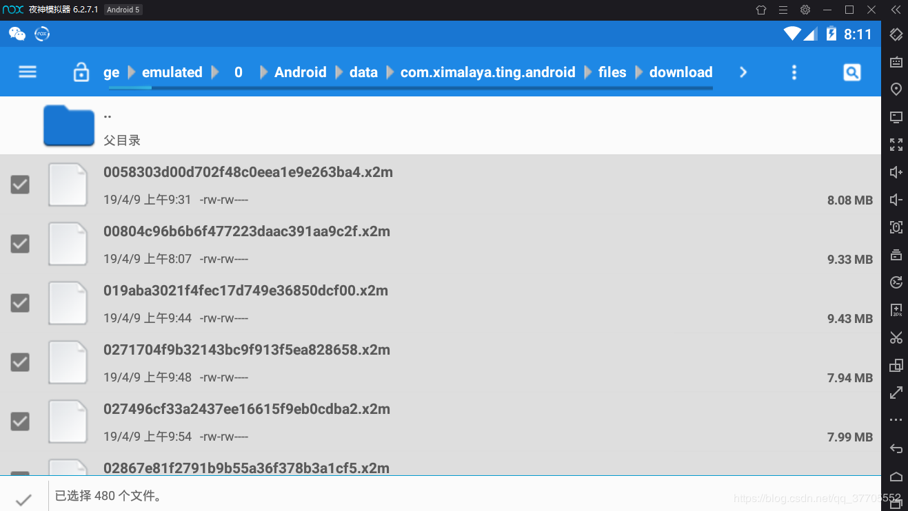

按右上角那个三个点，有全选的选项，选择文件后，直接退回根目录，找到默认的共享文件夹：
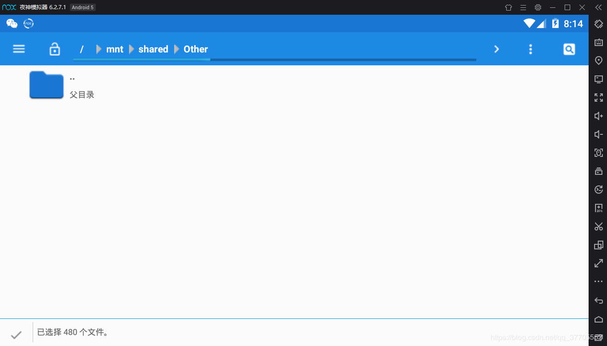

再按右上角三个点，在弹出的窗口中选择复制到此文件夹。
然后点击右侧栏目中的电脑图标弹出如下窗口：

在其他文件中选择打开电脑文件。
知道了文件的路径，打开x2m破解软件，按照他的说明操作，等待破解后，就可以享受了。当然你也可以选择先改名后破解，顺序无所谓，只是操作的时候，软件中输入的文件后缀名需要改一下。

改名步骤：
改名还需要一个db文件：按照之前音频文件的操作来。
附：db文件路径：
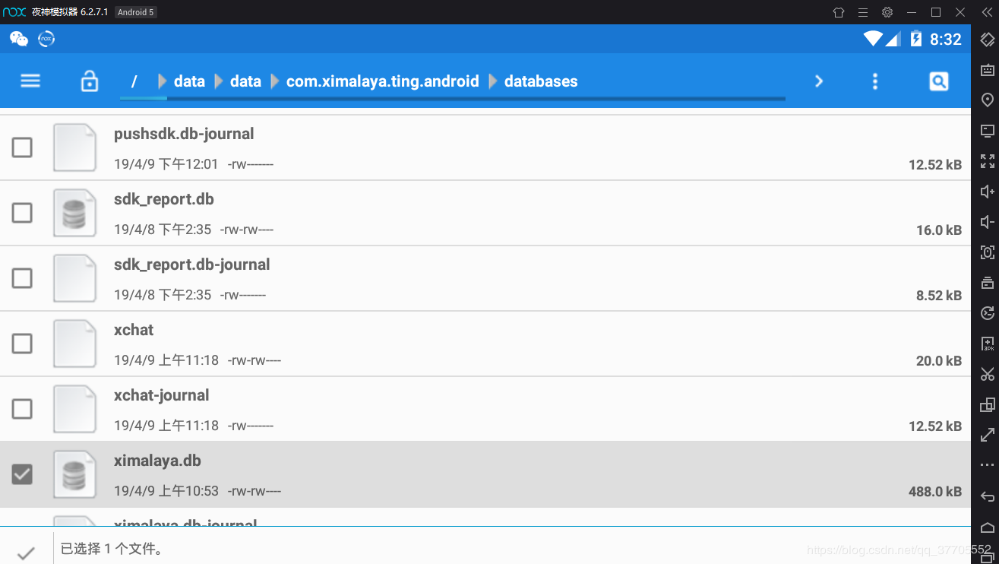

打开压缩包，找到exe双击:
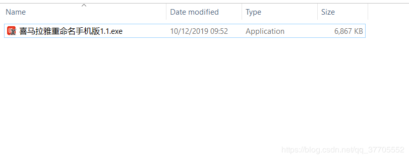

输入存放音频的目录名：

输入db:

这张图片是普通音频，注意普通音频下下来都是这种没有后缀名的因此改名的话直接忽略后缀名按回车：
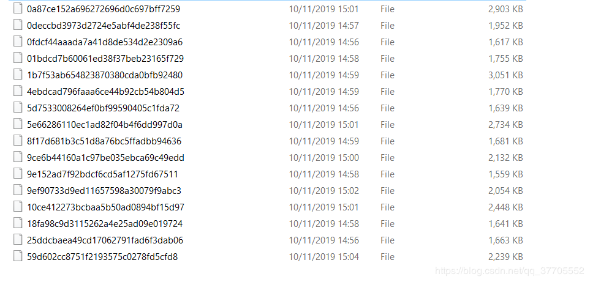

改名后：
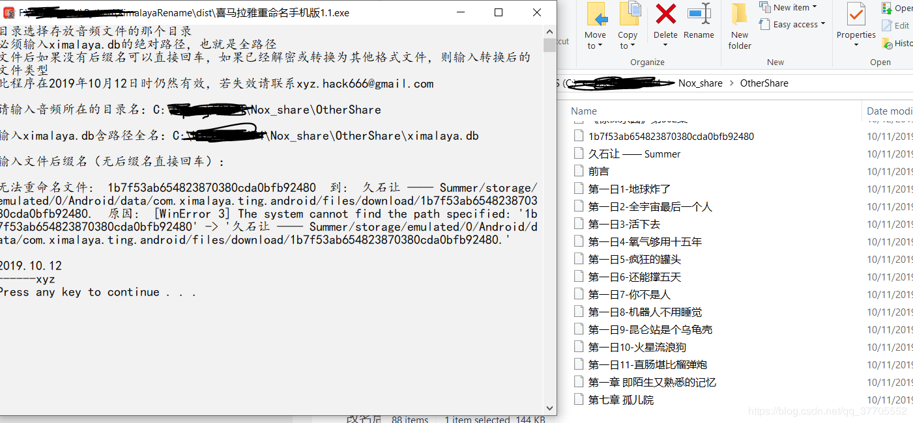

这里如果发生错误会打印出错误信息，然后如果你文件夹中包含不同格式的文件，那必然会发生找不到文件的错误，这是正常的，请自己忽略。

付费音频下下来都是x2m格式的
也就是说现在你要重命名后缀名为x2m的文件就需要再走一次上面的流程，但是后缀名要填写x2m:
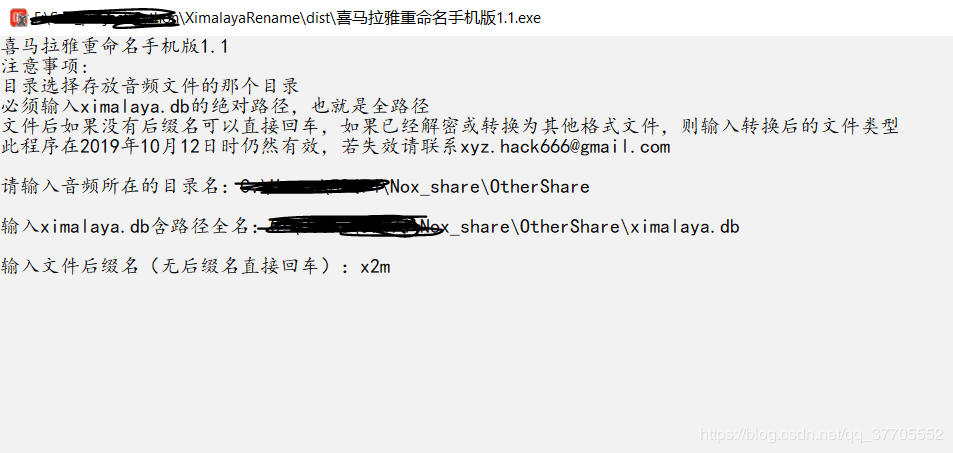

破解x2m
x2m破解软件 ps:这个软件是网上资源
https://pan.baidu.com/s/1JXG3HTbMbN8Lt3bbvuZLFg
提取码：w3ki

### Windows PC version

这个是专门针对windows喜马拉雅app下载下来的文件:
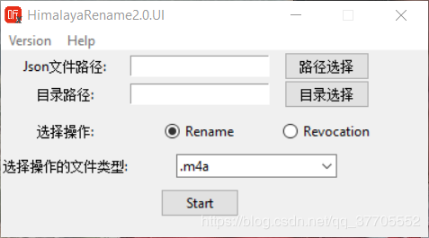

找到文件下载位置：
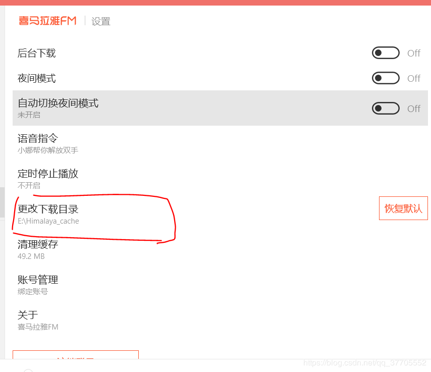

首先找到下载文件， 打开文件夹：
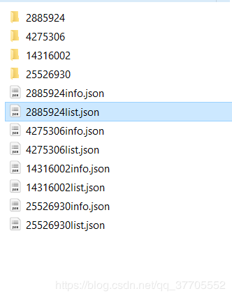

可以看到这里有很多的文件，解释一下，一个专辑有三个文件，两个json文件加一个文件夹，文件夹内存放的就是音频文件
首先我们要找到我们希望更改的是哪一个专辑 打开 ....info.json 可以在里面找到专辑的名称，用txt打开即可：
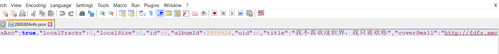
可以看到2885924info.json里面显示的是这个专辑的信息。因此如果我们要改这个专辑就要认准2885924这个文件夹和2885924list.json这两个文件:
 
打开软件：
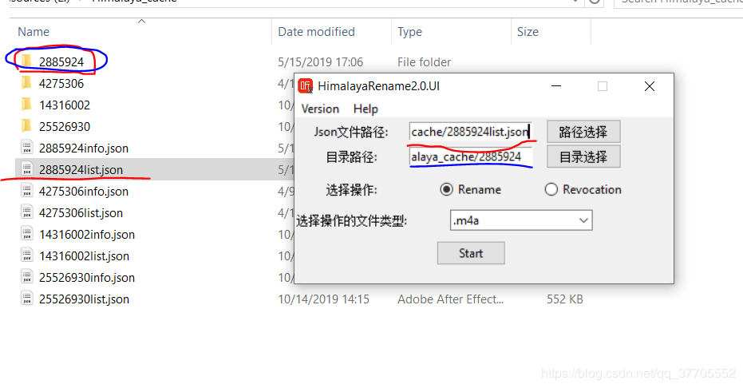
千万不要选错，另外不支持直接打路径和复制，请点击选择按钮进行文件和文件夹选择。

然后选择音频文件的类型：
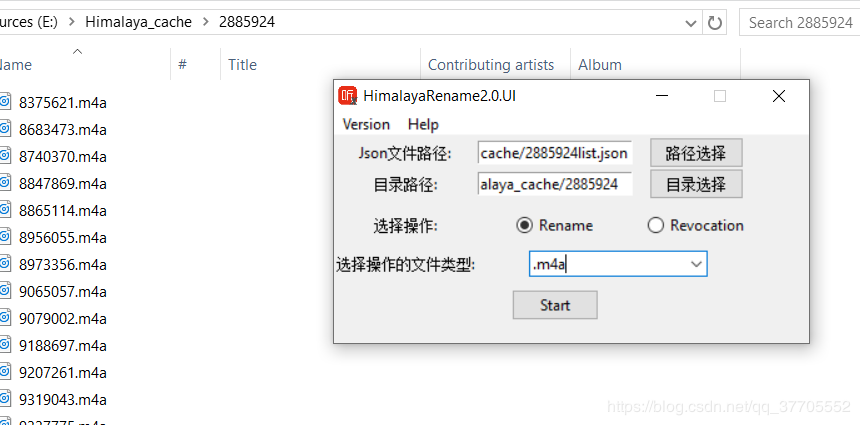

点击start

然后如果想改回去原来的名字就选择revocation。

注意：因为喜马拉雅文件名是可以重复的原因，有些文件改名了之后就无法复原了。因为我这个软件自动在后面添上id。。。。。。
